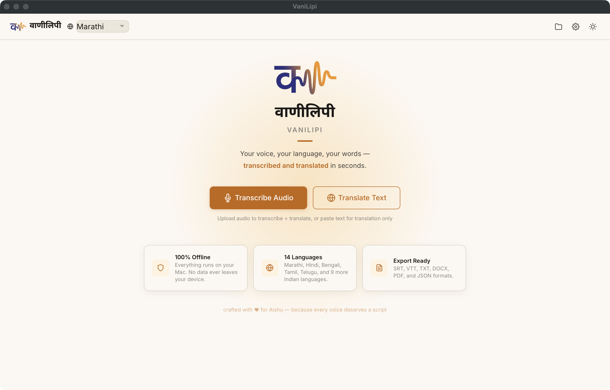

# VaniLipi

Offline speech-to-text and English translation for 14 Indian languages. Runs entirely on Apple Silicon, no internet needed.

Transcribes audio in Marathi, Hindi, Bengali, Tamil, Telugu, and 9 other languages, then translates to English. Everything stays on your Mac.



## Requirements

- macOS 12+ on Apple Silicon (M1/M2/M3/M4)
- Python 3.11+, arm64 native (not Rosetta)
- ffmpeg (`brew install ffmpeg`)
- ~5 GB disk space for bundled models

## Quick start

```bash
bash scripts/install.sh
bash scripts/launch.sh
```

Opens `http://localhost:7860` in your browser.

To create a desktop shortcut:

```bash
bash scripts/create_app.sh
```

## How it works

1. Upload audio (drag-and-drop or Browse)
2. Pick a language or leave it on auto-detect
3. Hit Transcribe. Segments stream in as they're ready.
4. Click any segment to edit the source text, then re-translate
5. Export to SRT, VTT, TXT, DOCX, PDF, or JSON

## Models

Both models run on Metal GPU via MLX. Nothing hits the network.

| Component | Model | Size | Framework |
|-----------|-------|------|-----------|
| ASR | Whisper large-v3 | 2.9 GB | mlx-whisper |
| Translation | IndicTrans2 1B, fp16 | 1.9 GB | MLX |

Bundled under `models/asr/` and `models/translation/`. They load one at a time to stay within 16 GB unified memory.

## Under the hood

### PyTorch to MLX conversion

IndicTrans2 1B ships as a PyTorch model on HuggingFace (`ai4bharat/indictrans2-indic-en-1B`). We converted it to MLX fp16 for native Apple Silicon inference. The process:

1. Load the original safetensors, remap all parameter names from HuggingFace convention to our MLX module hierarchy (e.g. `model.decoder.layers.0.self_attn.k_proj.weight` becomes `decoder.layers.0.self_attn.key_proj.weight`).
2. Cast all weights to float16. Final file: 762 parameters, 1.9 GB.
3. Extract `lm_head.weight` separately. The 1B model has `share_decoder_input_output_embed: false`, so the output projection is its own matrix, not a pointer to the decoder embedding table. Missing this produces correct-looking logits that always pick EOS.

Three bugs in the positional embedding implementation took the model from "generates EOS on step 0" to "translates correctly":

- **Layout**: fairseq concatenates `[sin_all_dims, cos_all_dims]`. We had interleaved `[sin0, cos0, sin1, cos1, ...]`. Wrong layout means every position looks like every other position to the model.
- **Divisor**: fairseq divides by `half_dim - 1` (511 for d_model=1024). We had `d_model` (1024). This compresses the frequency spectrum and makes distant positions indistinguishable.
- **Offset**: fairseq positions start at `padding_idx + 1 = 2`, not 0. Off-by-two means every token attends with the wrong positional signal.

Each bug independently causes the decoder to emit EOS immediately. All three had to be fixed together before any output appeared.

### KV-cache beam search

The decoder caches projected key/value tensors across steps. Each step feeds one new token through the 18-layer decoder instead of rerunning the full sequence. Cross-attention K/V are computed once from the encoder output and reused for every subsequent step. Decoding cost drops from O(n^2) to O(n).

When beams swap positions during search, the cache is reindexed to stay consistent with the new beam layout.

### Chunked interleaved pipeline

Long files (up to 3 hours) get split into 5-minute chunks. For each chunk: transcribe with Whisper, unload ASR, translate with IndicTrans2, stream results to the UI, then move on. You see output as it's produced rather than waiting for the whole file.

Timestamps carry a per-chunk offset so segments stay correctly aligned across boundaries.

### Hallucination filtering

Whisper hallucinates in predictable ways. Three filters catch them:

- **no_speech_prob > 0.6**: Whisper thinks the segment is silence but generated text anyway. Common on music, noise, or trailing silence.
- **Repeated n-gram loops**: Whisper gets stuck ("thank you thank you thank you"). Flagged when the most common bigram or trigram covers > 50% of all positions.
- **Text density > 15 chars/sec**: More characters than the audio window could realistically produce.

Detected segments become `[inaudible]` instead of being dropped, so the timeline stays intact.

### Initial prompts for ASR

Whisper's `initial_prompt` biases the decoder toward correct orthography. VaniLipi passes vocabulary hints for Marathi and Hindi: common conjunct words, foreign names in Devanagari. This fixes the worst ASR errors: broken word boundaries, phonetic substitutions (e.g. "soatantra" instead of "svatantra"), and Devanagari/Latin confusion.

## Supported languages

| Language | Script | Quality | Recommended |
|----------|--------|---------|-------------|
| Hindi | Devanagari | Very good | Yes |
| Marathi | Devanagari | Good | Yes |
| Bengali | Bengali | Good | Yes |
| Tamil | Tamil | Good | Yes |
| Telugu | Telugu | Good | Yes |
| Urdu | Perso-Arabic | Good | No |
| Gujarati | Gujarati | Fair | No |
| Kannada | Kannada | Fair | No |
| Malayalam | Malayalam | Fair | No |
| Punjabi | Gurmukhi | Fair | No |
| Nepali | Devanagari | Fair | No |
| Sindhi | Devanagari | Poor | No |
| Assamese | Bengali | Poor | No |
| Sanskrit | Devanagari | Poor | No |

## Keyboard shortcuts

| Shortcut | Action |
|----------|--------|
| Space | Play/Pause |
| Tab | Next segment |
| Shift+Tab | Previous segment |
| Enter | Edit selected segment |
| Escape | Cancel edit |
| Cmd+E | Export menu |
| Cmd+F | Search transcript |
| Cmd+1/2/3/4 | Playback speed (0.75x-1.5x) |

## Audio formats

MP3, WAV, M4A, FLAC, OGG, MP4, MKV, WebM. Auto-converted to 16kHz mono WAV. Max duration: 3 hours.

## Architecture

```
VaniLipi.app (Automator)
  └── scripts/launch.sh
        └── uvicorn backend.main:app  (FastAPI, port 7860)
              ├── GET  /                     → React SPA
              ├── POST /api/upload            → validate + save audio
              ├── WS   /api/stream/{file_id}  → streaming transcription
              ├── POST /api/transcribe        → batch transcription
              ├── POST /api/retranslate       → re-translate edited segment
              ├── POST /api/export/{format}   → export transcript
              ├── GET  /api/projects          → recent projects
              └── GET  /api/models/status     → model availability
```

ASR: mlx-whisper, Whisper large-v3, Metal GPU
Translation: IndicTrans2 1B fp16, MLX, KV-cached beam search
Frontend: Single-file React, wavesurfer.js, Noto Sans Devanagari
Privacy: Zero network calls. Audio never leaves your machine.

## Model credits

VaniLipi builds on two open-source model families. All inference runs locally — no data is sent to any server.

**Whisper large-v3** — OpenAI
Original model: [openai/whisper-large-v3](https://huggingface.co/openai/whisper-large-v3)
MLX conversion: [mlx-community/whisper-large-v3](https://huggingface.co/mlx-community/whisper-large-v3)
Paper: Radford et al., *Robust Speech Recognition via Large-Scale Weak Supervision*, 2022
License: MIT

**IndicTrans2 1B** — AI4Bharat, IIT Madras
Original model: [ai4bharat/indictrans2-indic-en-1B](https://huggingface.co/ai4bharat/indictrans2-indic-en-1B)
Paper: Gala et al., *IndicTrans2: Towards High-Quality and Accessible Machine Translation Models for all 22 Scheduled Indian Languages*, 2023
Toolkit: [VarunGumma/IndicTransToolkit](https://github.com/VarunGumma/IndicTransToolkit)
License: MIT

The IndicTrans2 weights were converted from PyTorch to MLX fp16 for native Apple Silicon inference (see "Under the hood" above).

## Development

```bash
source venv/bin/activate

python -m pytest tests/ -v

uvicorn backend.main:app --reload --port 7860

# Quick translation test
python -c "
from backend.services.translator import load, translate_batch, unload
load()
print(translate_batch(['नमस्कार, कसे आहात?'], src_lang='mar_Deva'))
unload()
"
```

## Troubleshooting

**App won't open:** System Settings > Privacy & Security > Open Anyway.

**Models not found:** Check that `models/asr/whisper-large-v3/` and `models/translation/indictrans2-1b/` have the weight files. They're excluded from git by `models/.gitignore`.

**MLX won't load:** Make sure Python is arm64: `python -c "import platform; print(platform.processor())"` should print `arm`.

**Bad accuracy:** See the quality column in the language table. "Poor" tier languages will need manual editing.

**Port conflict:** VaniLipi tries ports 7860-7869. Kill whatever's using them, or it'll find the next open one.
