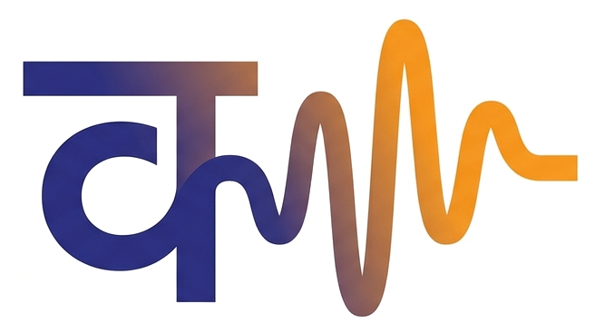
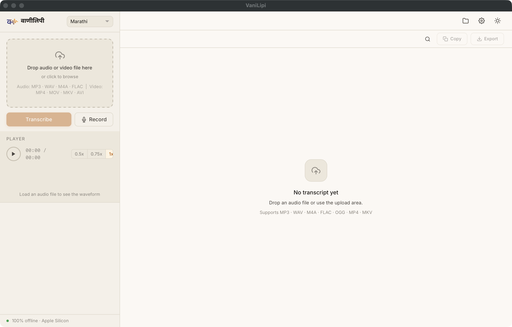

<div align="center">
  
  <h1>VaniLipi</h1>
  <p><strong>वाणीलिपी</strong> — Your voice, transcribed and translated</p>

  
  
  
  
  

  <p>Offline speech-to-text and English translation for <strong>14 Indian languages</strong>.<br/>
  Hindi, Marathi, Bengali, Tamil, Telugu, Urdu, Gujarati, Kannada, Malayalam, Punjabi, Nepali, Sindhi, Assamese, Sanskrit<br/><br/>
  Runs entirely on Apple Silicon. No internet, no cloud, no data leaves your Mac.</p>
</div>

---

<div align="center">
  
  <br/><br/>
  
</div>

---

## Features

- **14 Indian languages** — Hindi, Marathi, Bengali, Tamil, Telugu, Urdu, Gujarati, Kannada, Malayalam, Punjabi, Nepali, Sindhi, Assamese, Sanskrit
- **Transcribe + Translate** — Speech to native script, then English translation, in one pipeline
- **100% offline** — All models run locally on Metal GPU via [MLX](https://github.com/ml-explore/mlx). Zero network calls
- **Real-time streaming** — Segments appear as they're processed via WebSocket
- **Edit & re-translate** — Click any segment to fix the transcription, get a fresh translation
- **Export** — SRT, VTT, TXT, DOCX, PDF, JSON
- **Native macOS app** — pywebview WKWebView window, no browser chrome
- **Long audio** — Files up to 3 hours, chunked and streamed
- **Hallucination filtering** — Catches Whisper loops, silence hallucinations, and density anomalies
- **Keyboard-driven** — Full shortcut support for playback, navigation, editing, and export

## Models

Both models run on Metal GPU. They load sequentially to fit within 16 GB unified memory.

| Component | Model | Size | Framework |
|-----------|-------|------|-----------|
| Speech Recognition | [Whisper large-v3](https://huggingface.co/openai/whisper-large-v3) | 2.9 GB | [mlx-whisper](https://github.com/ml-explore/mlx-examples/tree/main/whisper) |
| Translation | [IndicTrans2 1B](https://huggingface.co/ai4bharat/indictrans2-indic-en-1B) | 1.9 GB | MLX (custom) |

> IndicTrans2 was converted from PyTorch to MLX fp16 for native Apple Silicon inference. See [Technical Details](#technical-details) below.

## Requirements

- macOS 12+ on Apple Silicon (M1 / M2 / M3 / M4)
- Python 3.11+, arm64 native (not Rosetta)
- ffmpeg (`brew install ffmpeg`)
- ~5 GB disk space for models

## Quick Start

### Option 1: Standalone App (recommended)

Download the `.dmg` from [Releases](https://github.com/kbichave/VaniLipi/releases), drag to Applications, and open. Everything is bundled — no setup needed.

> **First launch:** Right-click → Open to bypass Gatekeeper (one-time only).

### Option 2: From Source

```bash
git clone https://github.com/kbichave/VaniLipi.git
cd VaniLipi

# Install dependencies
bash scripts/install.sh

# Launch (native window)
bash scripts/launch.sh
```

## Usage

1. **Upload** — Drag an audio/video file onto the upload area, or click to browse
2. **Pick a language** — Select from the dropdown, or leave on auto-detect
3. **Transcribe** — Segments stream in with timestamps as they're processed
4. **Edit** — Click any segment to edit the source text, then get a fresh translation
5. **Export** — Download as SRT, VTT, TXT, DOCX, PDF, or JSON

### Supported Audio Formats

MP3, WAV, M4A, FLAC, OGG, MP4, MKV, WebM — auto-converted to 16kHz mono WAV.

## Technical Details

<details>
<summary><strong>PyTorch → MLX conversion</strong></summary>

IndicTrans2 1B ships as a PyTorch model on HuggingFace. We converted it to MLX fp16 for native Apple Silicon inference:

1. Load the original safetensors, remap all parameter names from HuggingFace convention to the MLX module hierarchy (e.g. `model.decoder.layers.0.self_attn.k_proj.weight` → `decoder.layers.0.self_attn.key_proj.weight`).
2. Cast all weights to float16. Final file: 762 parameters, 1.9 GB.
3. Extract `lm_head.weight` separately — the 1B model does not share decoder input/output embeddings.

Three positional embedding bugs had to be fixed simultaneously:

- **Layout**: fairseq concatenates `[sin_all_dims, cos_all_dims]`. We had interleaved `[sin0, cos0, sin1, cos1, ...]`.
- **Divisor**: fairseq divides by `half_dim - 1` (511 for d_model=1024). We had `d_model` (1024).
- **Offset**: fairseq positions start at `padding_idx + 1 = 2`, not 0.

Each bug independently causes the decoder to emit EOS immediately. All three had to be fixed together.
</details>

<details>
<summary><strong>KV-cache beam search</strong></summary>

The decoder caches projected key/value tensors across steps. Each step feeds one new token through the 18-layer decoder instead of rerunning the full sequence. Cross-attention K/V are computed once from the encoder output and reused for every step. Decoding cost drops from O(n²) to O(n).

When beams swap positions during search, the cache is reindexed to stay consistent with the new beam layout.
</details>

<details>
<summary><strong>Chunked interleaved pipeline</strong></summary>

Long files (up to 3 hours) get split into 5-minute chunks. For each chunk: transcribe with Whisper → unload ASR → translate with IndicTrans2 → stream results → next chunk. You see output as it's produced.

Timestamps carry a per-chunk offset so segments stay correctly aligned across boundaries.
</details>

<details>
<summary><strong>Hallucination filtering</strong></summary>

Whisper hallucinates in predictable ways. Three filters catch them:

- **no_speech_prob > 0.6** — Whisper thinks it's silence but generated text anyway
- **Repeated n-gram loops** — The most common bigram/trigram covers > 50% of positions
- **Text density > 15 chars/sec** — More characters than the audio window could produce

Detected segments become `[inaudible]` to preserve timeline integrity.
</details>

<details>
<summary><strong>Initial prompts for ASR</strong></summary>

Whisper's `initial_prompt` biases the decoder toward correct orthography. VaniLipi passes vocabulary hints for Marathi and Hindi: common conjunct words, foreign names in Devanagari. This fixes broken word boundaries, phonetic substitutions, and Devanagari/Latin confusion.
</details>

## Development

```bash
source venv/bin/activate

# Run tests
python -m pytest tests/ -v

# Dev server with hot reload
uvicorn backend.main:app --reload --port 7860

# Quick translation test
python -c "
from backend.services.translator import load, translate_batch, unload
load()
print(translate_batch(['नमस्कार, कसे आहात?'], src_lang='mar_Deva'))
unload()
"
```

## Troubleshooting

| Problem | Fix |
|---------|-----|
| App won't open | System Settings → Privacy & Security → Open Anyway |
| Models not found | Ensure `models/asr/whisper-large-v3/` and `models/translation/indictrans2-1b/` have weight files (excluded from git) |
| MLX won't load | Verify arm64 Python: `python -c "import platform; print(platform.processor())"` → `arm` |
| Poor accuracy | See quality column in language table — "Poor" tier needs manual editing |
| Port conflict | Kill processes on ports 7860–7869, or the app will auto-increment |

## Acknowledgments

VaniLipi builds on two open-source model families:

**[Whisper large-v3](https://huggingface.co/openai/whisper-large-v3)** — OpenAI
- MLX conversion by [mlx-community](https://huggingface.co/mlx-community/whisper-large-v3)
- Radford et al., *Robust Speech Recognition via Large-Scale Weak Supervision*, 2022
- License: MIT

**[IndicTrans2 1B](https://huggingface.co/ai4bharat/indictrans2-indic-en-1B)** — AI4Bharat, IIT Madras
- Toolkit: [IndicTransToolkit](https://github.com/VarunGumma/IndicTransToolkit) by Varun Gumma
- Gala et al., *IndicTrans2: Towards High-Quality and Accessible Machine Translation Models for all 22 Scheduled Indian Languages*, 2023
- License: MIT

## License

[MIT](LICENSE)
